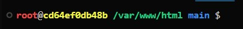

#  Blueberry Book

Manage your customers and their contacts in this simple laravel app.

Blueberry Book is a laravel app using inertia and vuejs.

## Installation
1. Clone the repository:
   ```bash
   git clone https://github.com/abrahambrookes/blueberry-book.git
   ```
2. Navigate to the project directory:
   ```bash
   cd blueberry-book
   ```
3. Build the docker stack:
   ```bash
   docker compose up -d
   ```
note: the container has been called `blueberry_book` in the `docker-compose.yml` file, so you can use `docker exec blueberry_book yada yada` to access the container shell. So now is a good time to:

4. Shell into the container:
   ```bash
   docker exec -it blueberry_book bash
   ```
You'll get a colourful shell so you know you're in the right place:



For simplicity, always work within the rainbow shell, and attach your vscode to this container using the Remote - Containers extension.

5. Install dependencies:
   ```bash
   composer install
   npm install
   ```
6. Copy the example environment file:
   ```bash
   cp .env.example .env
   ```
7. Generate the application key:
   ```bash
   php artisan key:generate
   ```
8. Migrate and seed the database:
   ```bash
   php artisan migrate --seed
   ```
9. Good to go - you can now access the app at `http://localhost:80` in your browser.

## Dev tools
### Aliases
`php artisan` is aliased to `art` so you can ie: `art migrate` instead of `php artisan migrate`.

### PHPMyAdmin
You can access PHPMyAdmin at `http://localhost:8080` to manage your database.

### Devcontainer
VSCode will notice there is a devcontainer spec in the folder and offer you to "relaunch in dev container" - click that button!
